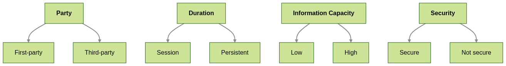

# 🍪 Cookie Taxonomy 

The taxonomy is faceted and describe Party (First or Third), Duration (Session or permanent), Security (Secure or Non-secure) and Information Capacity (High or Low) for each written cookie.

## Party

A cookie is classified as **first-party** if its `domain` attribute matches the domain (or is a subdomain) of the visited website.  Otherwise, it is classified as a **third-party** cookie.

Third-party cookies are considered a bigger privacy threat compared to first-party because they enable tracking across multiple websites. 

## Duration

A cookie is classified as **session** if it does not specify an expiration time (therefore, no `expires` and `max-age` attributes) and is removed when the browser session ends. If a cookie has an expiration time beyond the session, it is considered **persistent**.

Persistent cookies offer a greater privacy risk than session cookies, because they allow tracking and aggregation of user behavior accross different browsing sessions and extended periods of time. On the other hand, session cookies are ephemeral and have a short timeframe, generally not revealing identification of the user.  

## Security

A cookie is classified as **secure** if it has the `Secure` directive, indicating that they should only be sent over HTTPs. Otherwise, it is considered a **non-secure** cookie.

A Non-secure cookie can offer a greater privacy risk, as cookies often contain session identifiers or sensitive information and unauthorized access to cookies can cause insecurity threats, such as cross-site request forgery and cross-site scripting.

## Information Capacity

Cookies can have different goals in a website, such as tracking the behaviour of the user or storing user preference for the functionalities. One of the most important information to measure privacy risk of cookies is the presence of identifiable or identified information. However, the value of cookies do not follow a specific structure, making it hard to identify if a cookie is a identifier or not. 

Therefore, a heuristic to measure if a cookie is likely to contain an identifier is using its information capacity. Usually, preference cookies are short and human-readable, while identification cookies are longer and non-readable. 

Information capacity characterizes the ability of cookie values to encode a large number of distinct states, enabling potential user identification. A cookie has a **high** information capacity if it has more than 16 characters and contains digits and special characters. Otherwise, it has **low** information capacity.

 

# ⚠️ Severity measure

The taxonomy characterizes the properties of a cookie written before user interaction. However, websites differ in the overall exposure to privacy risks. To compare websites, we define a severity measure that aggregates cookie-level properties into a website-level score.

Severity is a metric for the risk of privacy threats enabled before user consent, based on the cookie's characteristics. It does not represent an actual harm per se, but quantifies the privacy threatening exposure.

## Weights

Different facets of the taxonomy have different impacts on the surface of privacy risk.

- **Third-party cookie:** +2
- **Persistent cookie:** +1
- **High information capacity cookie:** +3
- **Non-secure cookie:** +1

First-party, session, low information capacity and secure cookies receive a weight of 0.

## Cookie-level

Each cookie written before the first user interaction with the cookie banner has a severity score, computed as the sum of the weights associated with its taxonomy values. 

For a cookie `c`, the severity is defined by the following equation:

where `w_i(c)` is the weight corresponding to the value of the cookie `c` in a facet `i`.

## Website-level

The website-level severity is the aggregation of the severit scores of all cookies written before user interaction. It is divided by the number of cookies written to normalize and allow comparisons between websites.

For a website `w`, the severity is defined by the following equation:

where `C_w` is the set of cookies written by website `w` before user interaction.
