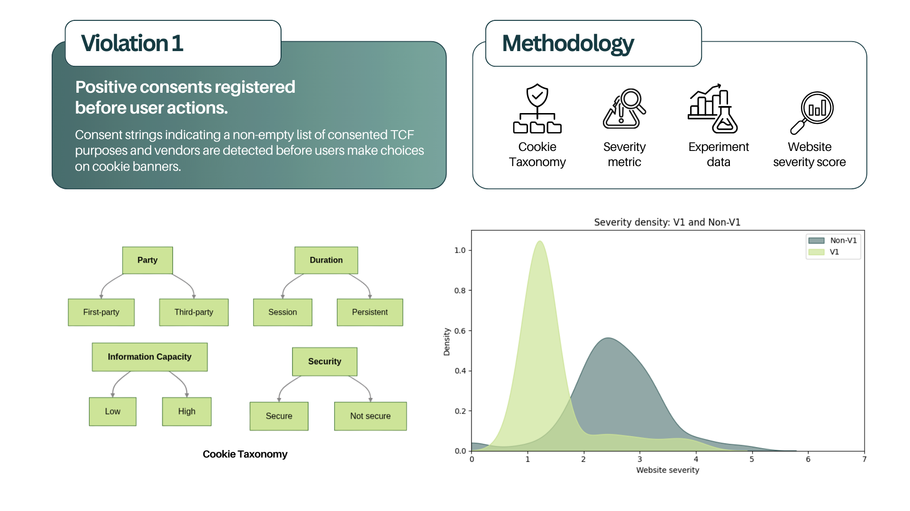
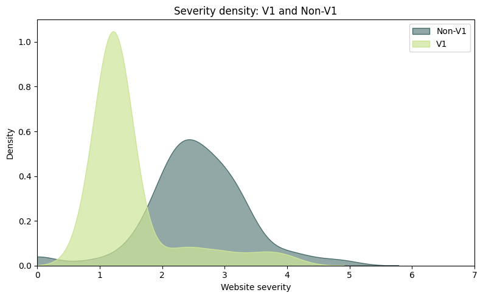

# Group 10 Project 1: Non-Compliance and Privacy Risk Surface on Cookie-Banner Interaction

Paper ID: [11 - CSChecker: Revisiting GDPR and CCPA Compliance of Cookie Banners
on the Web](https://dl.acm.org/doi/pdf/10.1145/3597503.3639159).

## Cookie-based privacy risk severity metric for websites

_By Giane Mayumi Galhard (ggalha)_



I first propose a [Cookie Taxonomy](./CookieTaxonomy.md) based on privacy threat modeling from Linddun[¹](https://linddun.org/)
 and Solove's Taxonomy of Privacy[²](https://enterprivacy.com/wp-content/uploads/2017/08/A-taxonomy-of-privacy.pdf). Using this taxonomy, I assign weights to cookie characteristics and define a [cookie-level privacy risk severity metric](./CookieTaxonomy.md#%EF%B8%8F-severity-measure). Then, I aggregate the cookie-level severities into a [website-level severity score](./CookieTaxonomy.md#website-level), normalized by the number of cookies.

Additionally, I implemented a [script](./src/pipeline.py) that computes severity scores from CSChecker logs, focusing on cookies written before user consent. All the websites on the logs are used in the analysis. Websites are separated into the ones that violate Vulnerabily #1 (register positive consent string before user actions) and the ones that do not. Despite complying with TCF v2.1, websites that do not violate Vulnerability #1 demonstrate a [statistically significant](./plots.ipynb) higher privacy risk severity than the violating websites, as shown through t-testing (9.442), p-value (2.171e-17) and a [density plot](./img/density_plot.png).

More detailed methodology and results can be found below.

**Outcome**

Proposition of a [cookie taxonomy](./CookieTaxonomy.md) based on privacy threat risk, definition of a [severity metric](./CookieTaxonomy.md#%EF%B8%8F-severity-measure) derived from cookies written before user interaction, and [comparison](./img/density_plot.png) between websites that violate Violation #1 from the paper and those that do not.

**GenAI Disclosure**

Used Grammarly to correct english grammar and wording.

<br/>

### 📢 Analysis Overview & Methodology


In the paper, they define vulnerability #1 as "Positive consents registered before user actions" as "Consent strings indicating a non-empty list of consented TCF purposes and vendors are detected before users make choices on cookie banners". 

To detect this violation, CSChecker identifies websites that adopt TCF v2.1 in the automated crawling, record the cookie writes and extracts network activities with consent strings from performance logs. They report a violation if the website used a positive consent string before user interaction with the banner.  

The paper detects binarily if a website has this violation, however some websites may offer a bigger exposure to privacy threats based on the structure of the cookies they are writing before user consent. 

To characterize this heterogeneity and rank the websites based on how severe is the violation, I introduce a cookie taxonomy and define a "severity" as a metric for the risk of privacy threats enabled by cookies written before user consent.

Then, I developed a script to calculate the severity measure of each website of the dataset based on the logs of events before user consent from CSChecker, separated by websites that violates Violation #1 (also defined as "V1" accross the project) and websites that do not (defined as "Non-V1"). All the websites present on the logs are used in the analysis. They are both able to send cookies before user interaction, but Non-V1 does that in non-compliance with TCF v2.1.

This script generates files in "output/", which contains
```
[rank_id], [domain], [severity], [number of cookies]
```
for all the websites, separated by V1 and Non-V1.

Finally, this data is plotted in a density plot in order to determine distribution shape. Statistical tests (such as T-Test) are also applied to verify significant statistical difference between severity scores from V1 and Non-V1


<br/>

### 📁 Project Structure

```
.
├── dataset/                                      # Result of experiments from the paper
│   ├── Non-V1-Websites/                          # Websites with no Violation#1
│   │   └── [rank_id].[main/sub].[count].store    # Record cookies
│   ├── V1-Violating-Websites/                    # Websites with Violation#1
│   │   └── [rank_id].[main/sub].[count].store
│   ├── non-v1.txt                                # Rank id to domain map (no violation#1) 
│   └── v1.txt                                    # Rank id to domain map (violation#1)
├── img/                                          # Images for report 
├── output/                                       # Raw outputs from the analysis
│   ├── non_v1.txt                                
│   └── v1.txt
├── CookieTaxonomy.md                             # Cookie Taxonomy and Severity metric description
├── src/                             
│   ├── models.py                                 # Classes for the analysis
│   ├── utils.py                                  # Util functions for the analysis
│   ├── pipeline.py                               # Analysis pipeline
│   └── requirements.txt
├── plots.ipynb                                   # Plots and statistics of results                  
└── README.md                
```


<br/>

### 💻 Usage

0. Create a virtual environment _(optional)_ [\[1\]](https://www.w3schools.com/python/python_virtualenv.asp)


1. Install the requirements.txt

```bash
cd src
pip install requirements.txt
```

2. Run the pipeline script

```bash 
python3 pipeline.py
```

The outputs will be generated on the `output/` folder.

You can regenerate plots on `plots.ipynb`


<br/>

### 📊 Summary of Results

Besides the [Cookie Taxonomy and Severity metric definition](./CookieTaxonomy.md?ref_type=heads#%EF%B8%8F-severity-measure), it is found that websites that commit _Violation \#1_ have a more concentrated distribution in terms of their Website Severity metric. Interestingly, through statistical tests, websites that to not commit this violation seem to have a less dense distribution, yet a higher value for the Severity metric. 




<br/>